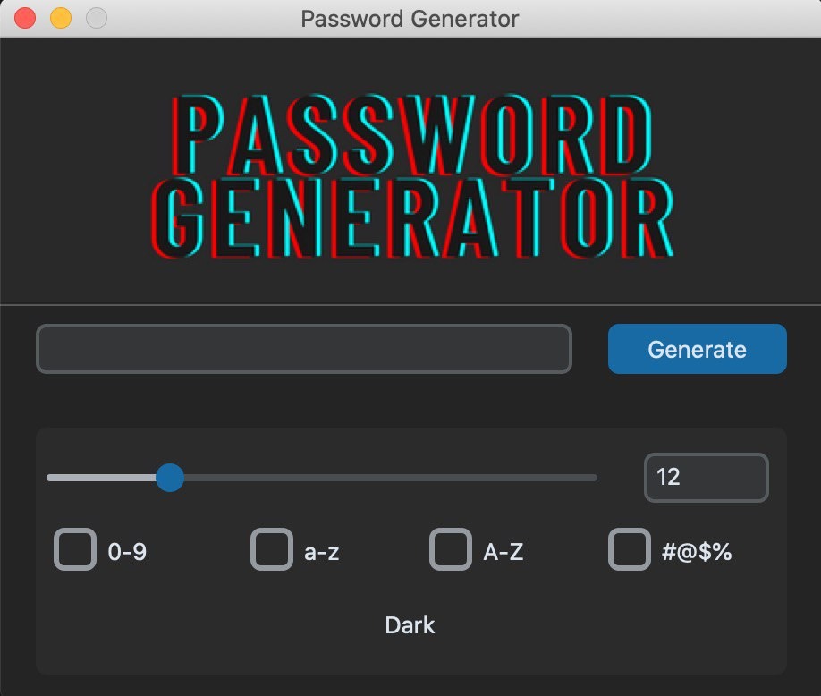

# **Password generator**
## How to use -
  * Clone this rep by - `git clone https://github.com/BoDeaD/Password-Generator.git`
  * Run file named ***main.py***

Now you can see the opened window(*460x370*).
Put a tick for symbols that you want to see in your password and scroll the scroll bar for needed password lengh. Than click on button Generate) :grin:
## GUI -

___
## __Packages used__ -
  1. [**tkinter**](https://docs.python.org/3/library/tkinter.html)
  2. [**customtkinter**](https://pypi.org/project/customtkinter/0.3/)
  3. [**PIL**](https://pypi.org/project/Pillow/)
  4. [**secrets**](https://docs.python.org/3/library/secrets.html)
